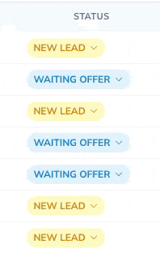

# Nova Inline Badge Field

[](https://packagist.org/packages/versioon/nova-inline-badge-field)
[](https://packagist.org/packages/versioon/nova-inline-badge-field)

This [Laravel Nova](https://nova.laravel.com/) package adds an inline badge field to Nova's arsenal of fields.

## Requirements

- `php: >=8.0`
- `laravel/nova: ^5.0`

## Features

A `Select` field on Form views that renders as a colored badge on Index and Detail views. Clicking the badge opens a native `<select>`; picking a value sends a Nova update request for the resource and re-colors the badge inline — no need to open the edit form.



## Installation

Install the package in to a Laravel app that uses [Nova](https://nova.laravel.com) via composer:

```bash
composer require versioon/nova-inline-badge-field
```

## Usage

### General

The field extends Nova's `Select` field, so `options()` defines the dropdown choices used on both the form and the inline editor. `map()` maps each value to a badge type (`success`, `info`, `danger`, `warning`, or a custom type registered via `types()`).

```php
use Versioon\NovaInlineBadgeField\InlineBadge;

public function fields(Request $request) {
    InlineBadge::make('Status')
        ->options([
            'draft' => 'Draft',
            'published' => 'Published',
            'archived' => 'Archived',
        ])
        ->map([
            'draft' => 'warning',
            'published' => 'success',
            'archived' => 'danger',
        ]),
}
```

### Customizing badges

The following `Badge`-style helpers are available in addition to everything inherited from `Select`:

```php
InlineBadge::make('Status')
    ->options([...])

    // Map field values to built-in or custom badge types.
    ->map(['draft' => 'warning', 'published' => 'published'])

    // Register custom badge types and their CSS classes.
    ->types([
        'published' => 'bg-green-100 text-green-600 dark:bg-green-500 dark:text-green-900',
    ])

    // Override the label shown on the badge per value...
    ->labels(['published' => 'Live'])
    // ...or resolve it with a callback.
    ->label(fn ($value) => ucfirst($value))

    // Show an icon on the badge (defaults provided for the built-in types).
    ->withIcons()
    ->icons(['published' => 'check-circle']),
```

If a value isn't present in `map()`/`types()`, the badge renders without a color class. Labels fall back to the matching `options()` label, then to the raw value.

## Credits

- [Tarvo Reinpalu](https://github.com/tarpsvo)

## License

Nova Inline Badge Field is open-sourced software licensed under the [MIT license](LICENSE.md).
